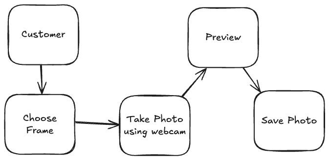
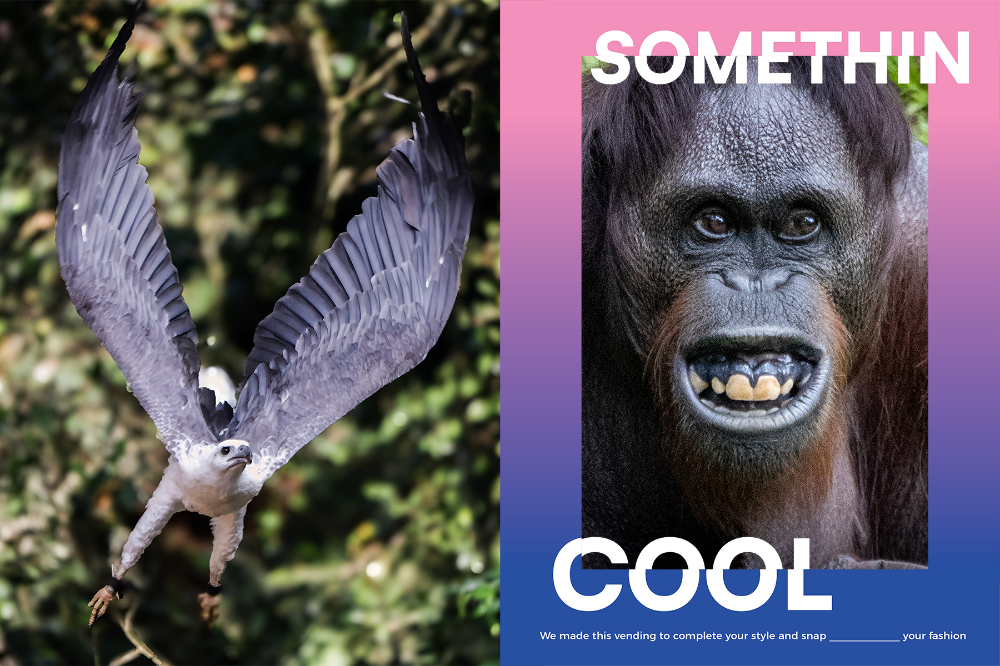
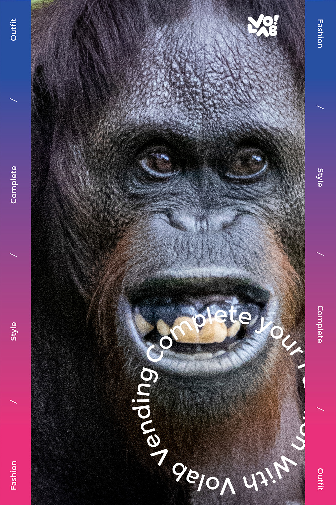

# Case for Volab

## Flow

## Frame
- assets/Frame-Landscape.png
- assets/Frame-Portrait.png

## Rules
- Framework
    - ReactJS
    - TailwindCSS
    - ViteJS
    - Typescript
- Bisa menggunakan library pihak ke 3
- Bundle File tidak lebih dari 1MB (tidak termasuk frame)
- Client Side Rendering
- upload di github sourcecodenya untuk review

## Result

